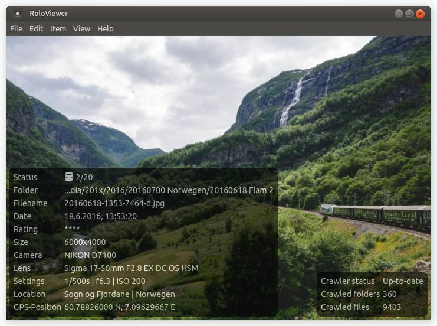

![License][license-image]

# RoloViewer

### And yet another image slideshow viewer...

<br/>



## Features

- shows pictures (jpg) in directories or playlists (txt, m3u)
- **digital photo frame mode**
    - selects randomly folders and shows a handful pictures
      (so not like the standard digital photo frame, who jumps immediatly to the next folder
      => minimises headache caused by context jumping...)
    - filter directories by name snippets (white- and blacklists)
    - filter images by rating or tags (xmp; white- and blacklists)
    - favors images by rating
- integrated Exiftool
    - show image details (date, rating, camera + lens models, gps location)
    - open image location in browser (if any; predefined is openstreetmap)
- supports ICC color profiles
- fullscreen modus available
- transitions (at moment only crossfades; more are planed)
- configuration via file (ini style) and some command line options
- runs on Linux and Windows
- screensaver mode: finishs at the first mouse move or key press
- able to block the system power saving for some time
- (drag&) drop images or directories


## Usage

Most functionality is self explanatory - see menu or the hot key list (F1).

Some of the configuration has to be written into a file (e.g. filtering by tags and rating, blacklisting).

There are some commandline switches which overwrite the settings from config file.


### Configuration via file

```ini
[crawler]
# source folders (when choosing folder via menu, both entries are overwritten)
sourceFolders[]=/home/data/pictures/folder1
sourceFolders[]=/home/data/pictures/folder2
# shows picture ratings (whitelist)
showRatings[]=0
showRatings[]=3
showRatings[]=4
showRatings[]=5
# tag filter (whitelist), shows only pictures with containing these tags , (be careful!)
showTags[]=holiday
showTags[]=nice
# don't show pictures from thes folder (blacklist)
blacklistFolders[]=/home/data/pictures/office1
blacklistFolders[]=/home/data/pictures/exgirlfriends
# don't show pricture from folder, if the folder name contains one of these text snippets
blacklistFolderSnippets[]=office
blacklistFolderSnippets[]=exgirlfriends
# skip pictures, if the contain the folowing tags
blacklistTags[]=privat1
blacklistTags[]=privat2
# number of picture delivered from one folder at once
batchCount=10
# after x minutes the directories scann agein
updateDirsAfterMinutes=1440

[slideshow]
# text in details overlay (dialog) will be shorten to this length
detailsShortenText=50
# autoplay timer to go further (in milliseconds)
timer=7000
# transition time when auto playing (in milliseconds)
transitionTimeAutoPlay=3000
# transistion time when manually trigger next images (in milliseconds)
transitionTimeManual=600

[system]
# log level: error, warn, info, debug, silly
logLevel=debug
# disable system power saving for x minutes (restored on app exit too)
powerSaveBlockMinutes=30
#
mapUrlFormat="http://www.openstreetmap.org/?mlat=$LATI_NUM$>&mlon=$LONG_NUM$&zoom=15&layers=M"
```

Items are case sensitive!


### Configuration via command line arguments

- --autoselect / -a: Auto-select images (config source in config file)
- --configfile -c: Explicit config file ${defaultConfigInfo}
- --configreadonly: Do not wite changes to config file
- --fullscreen -f: Show fullscreen
- --help -h: show help message
- --open -o: Open playlist or directory (default: using crawler)
- --play -p: Auto play items
- --random -r: random order (implicit in screensaver mode)
- --screensaver -s: Screensaver mode - quit at most user actions (mouse move + click, space)


## Tipps & tricks

- Linux / AppImage - suppress questions for integrating into your system:

        ```bash
        $ mkdir -p $HOME/.local/share/appimagekit/
        $ touch $HOME/.local/share/appimagekit/no_desktopintegration
        ```


## Based on

- [Electron](http://electron.atom.io/)
- [chentsulin/electron-react-boilerplate](https://github.com/chentsulin/electron-react-boilerplate)
- React
- Exiftool


## Maintainers

- [Raul Rosenlöcher](https://github.com/rosenloecher-it)


## License

GPLv3 © [Raul Rosenlöcher](https://github.com/rosenloecher-it)

The code is available at [GitHub][home].


[home]: https://github.com/rosenloecher-it/roloviewer
[license-image]: https://img.shields.io/badge/license-MIT-blue.svg
